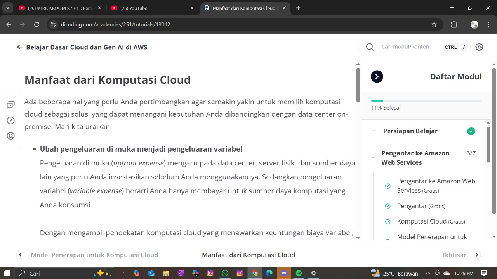

🌱 Portofolio Belajar IT - Tya

Halo! Aku Tya, pemula yang sedang belajar IT dari nol. Aku tertarik banget di bidang Web Development dan UI/UX. Portofolio ini adalah bukti langkah pertamaku untuk terus berkembang.

 • Portofolio PDF  
[Lihat PDF Portofolio](./tya-portfolio-fix.pdf)

 • Bukti Belajar
1. Belajar AWS Dasar di Dicoding  
   
2. Nonton HTML for Beginners – FreeCodeCamp  
   

 📝 Rencana belajar '1% for daily'
- Minggu 1–2: HTML & CSS dasar  
- Minggu 3–4: Bikin halaman web “About Me”  
- Bulan 2: JavaScript dasar  
- Bulan 3: Gabung komunitas / open source kecil

Terima kasih sudah membaca ❤
